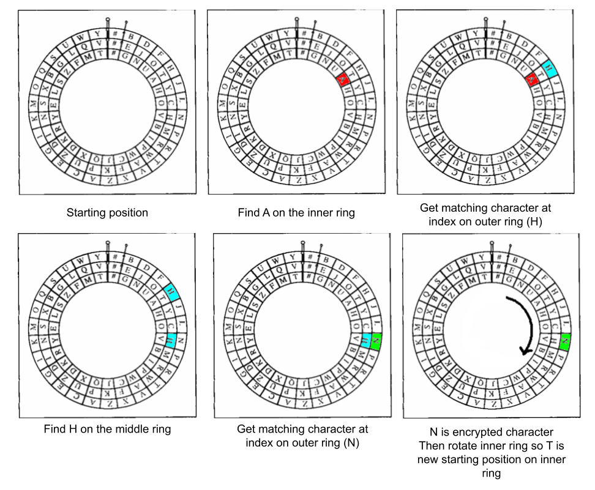

# Lab 7 - Enigma

## Overview

The Enigma machine was used by the Germans in WWII to send encoded messages. At the time, it was a breakthrough in cryptography, and was essentially an extremely advanced substitution cipher. The Enigma machine is also famous for not just being a very advanced cipher, but also because it was broken by none other than Alan Turning, the godfather of artificial intelligence (as seen in the movie, The Imitation Game.)

Enigma machines used interchangeable rotors that could be placed in different orientations to obtain different substitution patterns. More significantly, the rotors rotated after each character was encoded, changing the substitution pattern and making the code very difficult to break. The behavior of the rotating rotors can be modeled, in a simplified form, by a device consisting of labeled, concentric rings. 

In this lab, we will model a simplified version of the Enigma machine.

### The Enigma Machine

There are 3 rings in the Enigma machine: an outer, middle, and inner ring. Along the rings there are characters that align with each other. See the figure below as an example which converts the characters "A" into "N":



For example, in this configuration the character ‘A’ would be encrypted as ‘N’, since ‘A’ on the inner rotor is aligned with ‘H’ on the outer rotor, and ‘H’ on the middle rotor is aligned with ‘N’ on the outer rotor. After performing this encryption, the inner rotor is rotated clockwise, so the letter ‘A’ would next be encrypted as ‘D’.

Note that decrypting a message requires following the same steps, only in reverse: Find the character on the outer rotor, note the character aligned with it on the middle rotor, find that character on the outer rotor, then output the character aligned with it on the inner rotor. Don’t forget to rotate the rotors after each letter is decrypted. *The rotor is also rotated clockwise during decryption -- including when the rotor makes a full loop.* The middle and outer rotors also rotate clockwise


## Ring Defitions

You will use the following ring definitions for the integer values input into the command line arguments:

1. `#GNUAHOVBIPWCJQXDKRYELSZFMT`
2. `#EJOTYCHMRWAFKPUZDINSXBGLQV`
3. `#BDFHJLNPRTVXZACEGIKMOQSUWY`
4. `#NWDKHGXZVRIFJBLMAOPSCYUTQE`
5. `#TGOWHLIFMCSZYRVXQABUPEJKND`

For example, when a rotor using Rotor #1 definition (`"#GNUAHOVBIPWCJQXDKRYELSZFMT"`) is rotated one click clockwise, it's string sequence becomes `"T#GNUAHOVBIPWCJQXDKRYELSZFM"`, shifting the characters to the right and resetting the last character at the beginning.


## Encrypting / Decrypting

### Encrypting Algorithm
For each character c in the input text,
1. Get the character's index in the *inner* ring
2. Use that index to find the matching character on the *outer* ring
3. Get that character's index in the *middle* ring
4. Use that index to find the matching character on the *outer* ring
5. Add that character to the encrypted message
6. Rotate the inner ring clockwise
7. If the inner ring has done a full loop (back at the starting position it was at), rotate the middle ring clockwise.
8. If the middle ring has done a full loop (back at the starting position it was at), rotate the outer ring clockwise.


### Decrypting Algorithm (same as Encrypting but backwards order of rings)
For each character c in the input text,
1. Get the character's index in the *outer* ring
2. Use that index to find the matching character on the *middle* ring
3. Get that character's index in the *outer* ring
4. Use that index to find the matching character on the *inner* ring
5. Add that character to the decrypted message
6. Rotate the inner ring clockwise
7. If the inner ring has done a full loop (back at the starting position it was at), rotate the middle ring clockwise.
8. If the middle ring has done a full loop (back at the starting position it was at), rotate the outer ring clockwise.

*Note: Despite being backwards, the rings will still to rotate clockwise*

Encrypting a message should show the original message once it's decrypted!

## Code

You will create 2 classes for this assignment: Rotor and Enigma

### Rotor

Rotor will have the following components:
1. In the constructor, a minimum of 2 parameters: a **string** defining the rotor character sequence (see "Ring Definitions") and a **char** defining the top start position of the rotor (index 0 being the top most position). For example a Rotor instance defined by the following: `Rotor r = Rotor("#GNUAHOVBIPWCJQXDKRYELSZFMT", "A")` means the rotor sequence will start at the following position `"AHOVBIPWCJQXDKRYELSZFMT#GNU"` once encryption or decryption begins.

2. A public method that rotates the sequence one click clockwise. This should involve changing the string. (e.g. calling `r.rotate()` will change the sequence from `"AHOVBIPWCJQXDKRYELSZFMT#GNU"` to `"UAHOVBIPWCJQXDKRYELSZFMT#GN"`)

3. A public method that returns the index in the string at which a given character appears. (e.g. calling `r.getIndex("B")` when r's sequence looks like `"UAHOVBIPWCJQXDKRYELSZFMT#GN"` will return 5)

4. A public method that returns the character at a given index in the string (e.g. calling r.getChar(2) when r's sequence looks like `"UAHOVBIPWCJQXDKRYELSZFMT#GN"` will return 'H')

The method names can be whatever you want, but must include docstrings in the implementation for the method.

### Enigma

The Enigma class may be written however you'd like but must have the following public methods (in order to work with comms.cpp):

1. A constructor with **3 integers** for the rotor indices to use (inner, middle, outer) and a **3 character string** designating the starting positions of the 3 rotors (inner, middle, outer).
2. An `encrypt` method that takes in one input string parameter and returns the encrypted text of the original input
3. A `decrypt` method that takes in one input string parameter and returns the decrypted text of the original input

Any other methods or attributes created must be **private**. All methods must have docstrings in the implementation.

### comms.cpp

This will run the encryption and decryption program using the Enigma and Rotor classes. This file has command line arguments annotated as follows:

```
./comms [inner rotor #] [middle rotor #] [outer rotor #] "[inner start char][middle start char][outer start char]" [encrypt/decrypt] 

```

Below is an example call on the program setting the Enigma machine to encrypting mode using the 4th, 2nd, and 3rd ring definitions for the inner, middle, and outer rotors respectfully and using the characters X, #, and Y for the inner, middle, and outer starting positions of the rotors respectfully.

```
               ,-- inner rotor initially positioned so X is on top
               |,-- middle rotor initially positioned so # is on top
               ||  ,-- outer rotor initially positioned so Y is on top
               || /
./comms 4 2 3 "X#Y" encrypt
        | | |
        | | `-- outer rotor is rotor 3
        | `-- middle rotor is rotor 2
        `-- inner rotor is rotor 4
```

When running this file, input your string and it will be either encrypted or decrypted (as specified by the arguments)

```
./comms 1 2 3 "###" encrypt
AAA
NDU
```

```
./comms 1 2 3 "###" decrypt
YKE
WOW
```

**DO NOT CHANGE THIS FILE**

All of the instances created must work with your class definitions without modification to comms.cpp. If you change this file, you risk losing points from your implementation. 

## Makefile

Create a Makefile with the following targets:
1. `all` -- Compiles each of the classes into object files and the main file [comms.cpp] into an executable program called [comms]
2. `Enigma` -- Compiles the Enigma class into an object file Enigma.o 
3. `Rotor` -- Compiles the Rotor class into an object file Rotor.o
4. `clean` -- Removes the object files and the executable program

*Remember to use -c to compile to an object file instead of an executable program*

## README.md

Create a README.md file that includes the following as separate sections:
1. Name, Date, Program Description
2. Compiling and Running Instructions
3. Example usage of the program with input arguments for both encrypting and decrypting 2 different messages and its output

## Test Code and Examples [comms_key]

A test key program is given with [comms_key](comms_key) (and [comms_key_ALT](comms_key_ALT) for arm64 users.) This shows what the correct implementation of the Enigma program should look like. Optionally, this executable takes in an additional parameter for debugging the current sequences of the rotors and how the characters are accessed by index.

```
mcharit2@m1-mcs-mcharit2 lab7 % ./comms_key 1 2 3 "###" encrypt true           
WOW
-- LETTER [W] --
I: #GNUAHOVBIPWCJQXDKRYELSZFMT
M: #EJOTYCHMRWAFKPUZDINSXBGLQV
O: #BDFHJLNPRTVXZACEGIKMOQSUWY
I [W] -> 11 -> O [V]
M [V] -> 26 -> O [Y]

-- LETTER [O] --
I: T#GNUAHOVBIPWCJQXDKRYELSZFM
M: #EJOTYCHMRWAFKPUZDINSXBGLQV
O: #BDFHJLNPRTVXZACEGIKMOQSUWY
I [O] -> 7 -> O [N]
M [N] -> 19 -> O [K]

-- LETTER [W] --
I: MT#GNUAHOVBIPWCJQXDKRYELSZF
M: #EJOTYCHMRWAFKPUZDINSXBGLQV
O: #BDFHJLNPRTVXZACEGIKMOQSUWY
I [W] -> 13 -> O [Z]
M [Z] -> 16 -> O [E]

YKE
```

Use this executable file to verify your encryption and decryptions.

Here are more examples with various configurations:
```
./comms_key 3 1 2 "CAT" encrypt
I#HATE#MONDAYS
YZMFCAMGRNSW#P

./comms_key 5 2 4 "EST" decrypt
CSHIAWDFGDCOE#EZKJHRWAZDDCBCILON#PKUJEXEXSHINZ
THE#NATIONAL#ANIMAL#OF#SCOTLAND#IS#THE#UNICORN

./comms_key 4 2 3 "AI#" encrypt
ALAN#T#ONCE#ASKED#CAN#MACHINES#THINK
RAYMMFTSQWQXFTHUYRNQEEXDHWGRAXYRITBP

./comms_key 4 2 3 "U#R" encrypt
CPP#IS#A#PRETTY#COOL#LANGUAGE
BLBTHPQZXMLDNDNHDXNGLNKZTBYSY

./comms_key 4 2 3 "U#R" decrypt
QVCAHFUIFDAU##PEHWU
GO#RICHMOND#SPIDERS
```

## Rules

- You are allowed to use any resource so long as it follows the course syllabus and any external resource is cited in both the code (as a comment) and the README.md file.
- *NO VIBE CODING!* If you use an AI resource (e.g. Github Copilot, ChatGPT) cite it and provide a chat conversation link if possible.
- Only built-in libraries are allowed. Your program should not and cannot use anything that must be installed from an external source.
- You are *NOT* allowed to change comms.cpp for whatever reason.
- You are allowed to create any additional methods, attributes, or parameters for your class definitions so long as they work without changing comms.cpp

## Hints

- Create your own debug function to make sure the rings are updating appropriately and to see that the correct characters are being retrieved
- Try to encrypt a short message on paper first using the image with given then translate the algorithm steps to C++ code
- You can save the rotor string definitions as a string array in the Enigma class and define the rotor sequences using their indices.
- Create a helper method in the Rotor that checks whether the rotor has completed a full cycle. This can be used by the Enigma class to determine whether it should rotate the other outside rings.


## Rubric ( 100 Points total )

### Code Functionality

| Points | Criteria |
| :----: | :------- |
| **10 pts** | Rotor implemented with public methods specified |
| **10 pts** | Enigma implemented with public methods specified |
| **10 pts** | comms.cpp unchanged |
| **15 pts** | Code returns no errors |
| **5 pts** | Methods are documented with docstrings describing functionality |
| **35 pts** | Encryption and decryption returns accurate outputs |

**(85 points total)**


### Makefile

| Points | Criteria |
| :----: | :------- |
| **2 pts** | `all` target that makes targets except `clean` |
| **4 pts** | Targets for Enigma and Rotor |
| **2 pts** | `clean` target which removes all of the object files and the program executable |
| **2 pt** | No errors in the Makefile |

**(10 points total)**

### README.md

| Points | Criteria |
| :----: | :------- |
| **1 pt** | Name, Date, Program Description |
| **1 pt** | Section on how to compile and run the program |
| **2 pt** | Section with example calls to the program for both encrypting and decrypting with input messages (2 different messages) |

**(5 points total)**